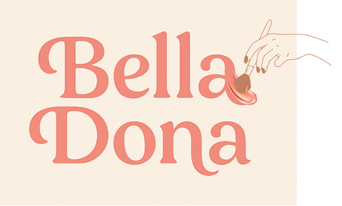

<div align="center">
  
  
  
  
  ### **E-commerce de Cosméticos**
  
  [](https://developer.mozilla.org/pt-BR/docs/Web/HTML)
  [](https://developer.mozilla.org/pt-BR/docs/Web/CSS)
  [](https://developer.mozilla.org/pt-BR/docs/Web/JavaScript)
  [](https://getbootstrap.com/)
  
  
  
  
  > *Atividade acadêmica de Desenvolvimento Web I — FATEC Cotia*

</div>

---

## 📖 Sobre o Projeto

A **Bella Dona** é uma loja virtual de cosméticos desenvolvida como atividade da disciplina de **Desenvolvimento Web I**. O projeto simula um e-commerce completo com navegação dinâmica entre seções sem recarregamento, utilizando o padrão **SPA (Single Page Application)** com `<template>` e JavaScript puro.

A identidade visual da marca utiliza tons **rosé, salmão e terracota**, com tipografia da família **Poppins**, transmitindo elegância, acolhimento e modernidade — valores que conversam diretamente com o público feminino que busca beleza e autocuidado.

---

## ✨ Funcionalidades

<div align="center">
  
| | | |
|:---:|:---:|:---:|
| 🛍️ **Catálogo de Produtos** | 🎠 **Carrossel de Destaques** | 🔐 **Página de Login** |
| 9 itens com cards interativos | Bootstrap Carousel animado | Formulário estilizado |
| 🛒 **Carrinho de Compras** | 💳 **Checkout** | 👤 **Menu do Usuário** |
| Tabela dinâmica + resumo | Validação nativa Bootstrap | Dropdown Login/Registrar |
| 🔍 **Barra de Busca** | 📱 **Responsividade** | ⚡ **Navegação SPA** |
| Filtro no header | Mobile → Desktop | Sem recarregamento |

</div>

---

## 🗂️ Estrutura do Projeto

```bash
belladona/
├── 📄 index.html               # Página principal (SPA)
├── 📄 login.html               # Página de login separada
└── 📁 img/
    ├── 🖼️ logo_fim.png         # Logo principal
    ├── 🖼️ logo.png             # Variação do logo
    ├── 🖼️ logo_2.png           # Variação do logo
    ├── 🖼️ banner.png           # Banner do header
    ├── 🖼️ base.png             # Base Líquida
    ├── 🖼️ batom_liquido.png    # Batom Líquido
    ├── 🖼️ blush.png            # Blush
    ├── 🖼️ body_splash.png      # Body Splash
    ├── 🖼️ kit_banho.png        # Kit Banho Premium
    ├── 🖼️ kit_paleta_colorida_-_carnaval.png
    ├── 🖼️ kit_skin_care.png    # Kit Skin Care
    ├── 🖼️ Mascara_de_Cílios.png
    └── 🖼️ pincel.png           # Kit Pincéis
```

---

## 🛠️ Stack Tecnológica

<div align="center">
  
| Tecnologia | Finalidade |
|------------|------------|
|  **HTML5** | Estrutura semântica |
|  **CSS3** | Estilização + animações |
|  **JavaScript ES6+** | Lógica SPA + navegação |
|  **Bootstrap 5.3** | Grid + componentes |
|  **Font Awesome 6** | Ícones vetoriais |
|  **Poppins** | Tipografia principal |

</div>

---

## 📄 Navegação SPA

O `index.html` utiliza o padrão **SPA com `<template>`**: ao clicar em um item da navbar, o JavaScript troca o conteúdo da `<div id="dynamicContent">` sem recarregar a página.

| Página / Template | Rota | Descrição |
|:---:|:---:|---|
| 🏠 **Catálogo** | `data-page="catalog"` | Carrossel + grid de produtos |
| 🛒 **Carrinho** | `data-page="cart"` | Tabela de itens + resumo |
| 💳 **Checkout** | `data-page="checkout"` | Endereço + pagamento |
| 🔐 **Login** | `login.html` | Página separada |

---

## 🎨 Identidade Visual

<div align="center">
  
| Elemento | Cor | Código |
|:---|:---:|:---:|
| **Primária** | Rosa | `#f8a99c` |
| **Secundária** | Salmão | `#f28c7d` |
| **Destaque** | Vermelho | `#dc3545` |
| **Fundo** | Terracota claro | `#faf0e2` |
| **Tipografia** | Poppins | `'Poppins', sans-serif` |

</div>

---

## ▶️ Como Executar

Por se tratar de um projeto **100% front-end**, não é necessária nenhuma instalação adicional.

```bash
# 1. Clone o repositório
git clone https://github.com/seu-usuario/belladona.git
cd belladona

# 2. Abra no navegador
open index.html   # macOS
start index.html  # Windows
```

> 💡 **Dica:** Para melhor experiência, utilize a extensão **Live Server** no VS Code — clique com botão direito em `index.html` → *"Open with Live Server"*

⚠️ **Atenção:** Certifique-se de que todas as imagens estejam na pasta `img/` com os nomes exatos listados na estrutura acima.

---

## 👥 Equipe de Desenvolvimento

<div align="center">
  
|  |  |  |  |  |
|---|---|---|---|---|
| **Ana Clara Madeira de Gois** | **Jennifer Gabriely Lopes dos Santos** | **Martie Bello Silva** | **Maysa Alexandre Nazario** | **Victória Heloísa de Melo Teixeira** |

</div>

---

## 🎓 Contexto Acadêmico

<div align="center">
  
| | |
|:---|:---|
| 🏛️ **Instituição** | FATEC Cotia |
| 📚 **Curso** | Desenvolvimento de Software Multiplataforma (DSM) |
| 💻 **Disciplina** | Desenvolvimento Web I |
| 📍 **Semestre** | 1º Semestre |
| 📅 **Período** | 2024 |
| 🎯 **Tipo** | Atividade Prática — Front-end |

</div>

---

<div align="center">
  <br>
  
  
</div>
